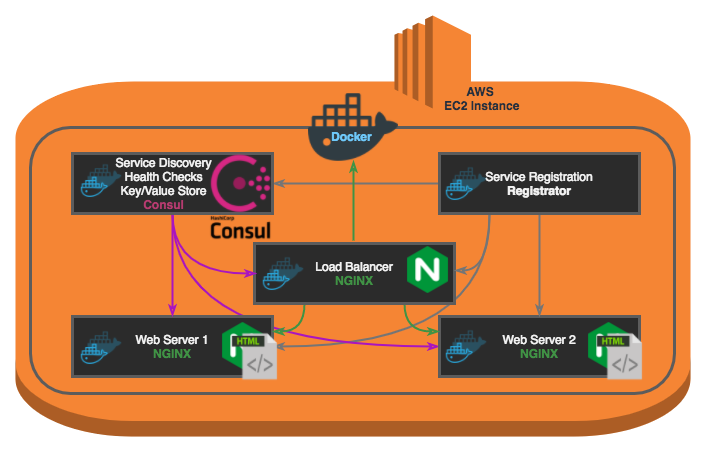
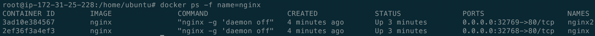

# DevOps Playground #15: All Hands on Consul!
## Introduction
During this meetup, we will see what Consul can do in terms of Service Discovery, Health Checking, and see how we can use its Key/Value store. We will create two nginx servers, serving two different pages. These pages will display keys from the K/V store of Consul using Consul Template. We will then dynamically load balance these two servers with a third nginx server, which will only send traffic to the servers that are online.



## Agenda

1. [Start a Consul Server](#start-a-consul-server)
2. [Configure and start Registrator](#start-registrator)
3. [Start two nginx servers](#start-two-nginx-servers)
4. [Setup the load balancer](#setup-the-load-balancer)


## Background

### Michel Lebeau
DevOps and CD Consultant @[ECS Digital](https://ecs-digital.co.uk)

[Email](mailto:michel@ecs-digital.co.uk)
[LinkedIn](https://linkedin.com/in/micheldlebeau)
[twitter](https://twitter.com/micheldlebeau) 
[Website](https://micheldlebeau.com)

### Consul

* Made by HashiCorp
* Open Source
* Service Discovery
* Health Check
* Distributed Key/Value Store
* Multi Datacenter

### Consul Template

* Convenient way to populate values from Consul on a file system running the consul-template daemon
* Consul-template queries a Consul or Vault cluster and updates any number of specified templates on the file system
* Can optionally run arbitrary commands when the update process completes

### Registrator

* Automatically registers and deregisters services for any Docker container by inspecting containers as they come online
* A service is anything listening on a port
* Any services Registrator finds on a container, they will be added to Consul’s service registry
* Supports Consul, etcd and SkyDNS 2

### Nginx

* Open Source
* Web server
* Reverse Proxy
* Load Balancer
* HTTP Cache

### AWS

Leading Cloud Services provider, we will be using an EC2 (Elastic Cloud Compute) instance each.

### Docker

Leading container platform which gives a layer of abstraction enabling us to run services in separate, contained environments.


## Hands-on!

### SSH into your instance
1. ssh devops@your.IP
1. You will be prompted to confirm that the key looks correct, type `y` then Enter
2. Then enter the password: `playground` and press Enter

### Start consul server

```
docker run -d \
  --name consul --net=host \
  -p 8500:8500 \
  -e 'CONSUL_LOCAL_CONFIG={"skip_leave_on_interrupt": true, "ui": true,  "dns_config": { "allow_stale": false }}' \
  consul:1.0.0 agent -server -bind="$(curl -s http://169.254.169.254/latest/meta-data/local-ipv4)" -client=0.0.0.0  -bootstrap
```
Details:

* `docker run`: run the docker container
* `-d`: deamon mode
* `--name consul`: give a human friendly name to our container
* `--net=host`: use the host's network, will make it easier for our containers to communicate with each other
* `-p 8500:8500`: link the port 8500 of our container with the port 8500 of our host, so that we can access the consul ui of our host from outside
* `-e 'CONSUL_LOCAL_CONFIG={"skip_leave_on_interrupt": true, "ui": true,  "dns_config": { "allow_stale": false }}'`: pass some configuration to consul
* `consul`: we will use the official consul image
* `agent -server`: we then pass options to our image, here we want to run the agent in server mode
* `-bind="$(curl -s http://169.254.169.254/latest/meta-data/local-ipv4)"`: bind the consul server to the private IP of our instance to make it easier for all our containers to talk to each other
* `-client=0.0.0.0`: accept connections from anywhere
* `-bootstrap`: let the consul server be the only server

### Start registrator
```bash
docker run -d \
    --name=registrator \
    --net=host \
    --volume=/var/run/docker.sock:/tmp/docker.sock \
    gliderlabs/registrator \
      consul://localhost:8500
```

Details:

* `--volume=/var/run/docker.sock:/tmp/docker.sock`: Allows Registrator to access Docker API
* `gliderlabs/registrator`:
* `consul://localhost:8500`: registry URL, in this case Consul

### Start two nginx servers

#### Create two index pages

```

echo "Server Nginx 1, Name: {{ keyOrDefault \"playground/server1\" \"server1 name missing\" }}" >> /tmp/index.html.1.template
echo "Server Nginx 2, Name: {{ keyOrDefault \"playground/server2\" \"server2 name missing\" }}" >> /tmp/index.html.2.template

```

Details:

* `{{ keyOrDefault \"playground/server1\" \"server1 name missing\" }}"`: will be replaced by consul-template with the value of the key `playground/server1`, or will be "server1 name missing" by default if no key with this name is present

#### Download Consul Template and install it

```
wget https://releases.hashicorp.com/consul-template/0.19.3/consul-template_0.19.3_linux_amd64.tgz -O /tmp/consul-template.tar.gz
sudo tar -xvzf /tmp/consul-template.tar.gz -C /bin
```

Details:

* `wget https://releases.hashicorp.com/consul-template/0.19.3/consul-template_0.19.3_linux_amd64.tgz -O /tmp/consul-template.tar.gz`: downloads the consul template archive in `/tmp`
* `tar -xvzf /tmp/consul-template.tar.gz -C /bin`: extracts the binary from the archive and place it in `/bin`

#### Render the templates

`nohup consul-template -template "/tmp/index.html.1.template:/tmp/index.html.1:/bin/bash -c 'docker restart nginx || true'" -template "/tmp/index.html.2.template:/tmp/index.html.2:/bin/bash -c 'docker restart nginx2 || true'" &`

Details:

* `nohup ... &`: will run the command in the background and detached, as consul template will run indefinitely, watching for changes
* `consul-template `: we call consul template
* `-template "/tmp/index.html.1.template:/tmp/index.html.1:/bin/bash -c 'docker restart nginx || true'"`: we let consul template know that it should use the template `/tmp/index.html.1.template`, and render it as `/tmp/index.html.1`, and finally run a command to restart the nginx container whenever the template is re-rendered


#### Look at the two index pages generated

```
cat /tmp/index.html.1
cat /tmp/index.html.2
```

#### Start nginx containers

```
docker run -d -P --name=nginx -v /tmp/index.html.1:/usr/share/nginx/html/index.html -e "SERVICE_NAME=webserver" nginx:1.13.5
docker run -d -P --name=nginx2 -v /tmp/index.html.2:/usr/share/nginx/html/index.html -e "SERVICE_NAME=webserver" nginx:1.13.5
```

Details:

* `-P`: make any ports used in the container available on the host, but let Docker handle it
* `-v /tmp/index.html.1:`: mount the `/tmp/index.html.1` file on our host as `/usr/share/nginx/html/index.html` in the container, which is the page that will be served by default as the root of the webserver
* `-e "SERVICE_NAME=webserver"`: let registrator know that this container is running the service webserver, and it will automatically register it with Consul
* `nginx:1.13.5`: use the official nginx image version 1.13.5

#### Query our two nginx servers
##### Get the ports on which they are accessible
`docker ps -f name=nginx`

This will display your two new nginx containers, and see the port mapping as seen below, where nginx and nginx2 are respectively running on the ports `32768` and `32769`. 


##### Query the servers
`curl localhost:32768`

#### Create the keys in the key/value store of Consul
Go to `http://<public IP>:8500/ui/`

1. In the top menu, click on the KEY/VALUE menu item.
2. In the Create Key box, add the `playground/server1` key and set its value to the name you want to give to your first server
3. Click the Create button
4. Repeat steps 2 and 3 for the key `playground/server2`


##### Query the servers again
`curl localhost:32768` and you should see your keys working!
You can change the values of the keys and see the result immediately.


### Setup the load balancer

#### Setup nginx.conf template

```
cat <<EOT >> /tmp/nginx.conf.template
upstream app {
  {{range service "webserver"}}server {{.Address}}:{{.Port}} max_fails=3 fail_timeout=60 weight=1;
  {{else}}server 127.0.0.1:65535; # force a 502{{end}}
}

server {
  listen 80 default_server;
  resolver 172.16.0.23;
  set \$upstream_endpoint http://app;

  location / {
    proxy_pass \$upstream_endpoint;
    proxy_set_header X-Forwarded-For \$proxy_add_x_forwarded_for;
    proxy_set_header Host \$host;
    proxy_set_header X-Real-IP \$remote_addr;
  }
}
EOT

```

Details:

* `cat <<EOT >> /tmp/nginx.conf.template `: will append everything that comes after this line and before the text `EOT` to the file `/tmp/nginx.conf.template`
* `upstream app { ... }`: set the list of servers that can handle requests
* `{{range service "webserver"}}server {{.Address}}:{{.Port}} max_fails=3 fail_timeout=60 weight=1;`: loop over all our services "webserver", effectively our two nginx webservers, and add their address then port to the template
* `{{else}}server 127.0.0.1:65535; # force a 502{{end}}`: if there is no service called webserver, then our list will be empty, so we do this little trick in order to return a 502 to the user
* `server { ... }`: configure our server
* `listen 80 default_server;`: listen on the port 80
* `resolver 172.16.0.23;`: set the DNS to be the one from AWS, this is needed for dynamic load balancing
* `set \$upstream_endpoint http://app;`: we escape the $ here so that `$upstream_endpoint` isn't interpreted by bash, and we let nginx know that the upstream endpoint is http://app, with app being one of the servers defined previously
* `location / { ... }`: this block takes care of proxying the details of the requests when the root page is called


#### Render nginx.conf file
```
nohup consul-template -template "/tmp/nginx.conf.template:/tmp/nginx.conf:/bin/bash -c 'docker restart nginx-lb || true'" &
cat /tmp/nginx.conf
docker stop nginx2
cat /tmp/nginx.conf
docker start nginx2
cat /tmp/nginx.conf
```


#### Start the load balancer
```
docker run -p 80:80 --name nginx-lb \
  -v /tmp/nginx.conf:/etc/nginx/conf.d/default.conf \
  -e "SERVICE_TAGS=loadbalancer" -d \
  nginx:1.13.5
```

You can now type your public IP (the one you were given on paper) in your browser and see your page.
Here are a few of things that you can try:

* Refresh several times, you will see the two pages alternate
* Change your values in Consul UI, notice how the text changes in your browser
* Change your index templates, notice what happens. Why?
* Shutdown nginx or nginx2 and see what happens if you refresh your browser. (hint: `docker stop nginx`, `docker start nginx`...)